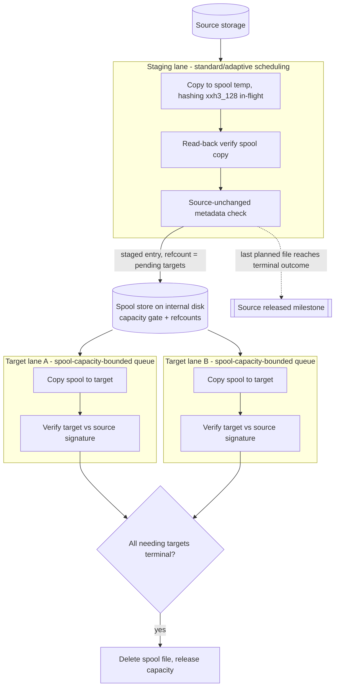
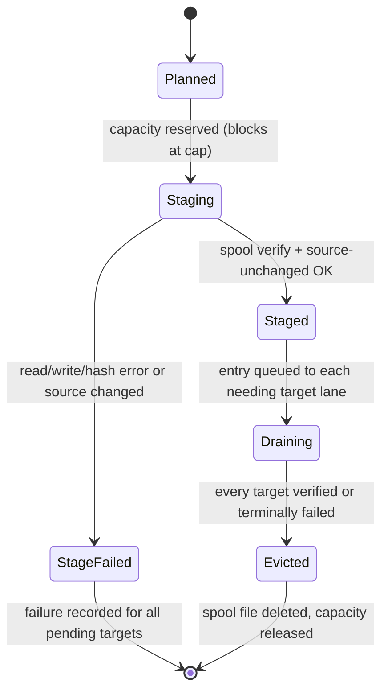

# feat: Spooled relay pipeline for early source release

## Summary

Add an opt-in staging mode where each planned source file is read once, copied to a spool on the host's internal storage with its `xxh3_128` signature computed in-flight, and every target is then served from the spool on its own independent lane. The run stops depending on the source as soon as all planned files are staged and verified — the UI announces the source as released — while slow targets keep draining the spool without blocking anything else, and every destination is still verified end-to-end against the original source signature.

## Problem Frame

pathsync already supports multi-target jobs with streaming destination verification, but the execution model couples everything to the source and to the slowest target:

- Every target copy reads from the source, so the source device (typically a camera card or portable drive) stays busy until the slowest target finishes. The user cannot disconnect or reuse the source until the whole run ends.
- Copy workers pull from one shared pool and slot budget, and completed transfers funnel into a single bounded verify queue drained by at most two verifier workers. A slow target's copies occupy shared slots, and its slow read-back verification can fill the verify queue and back-pressure copy workers serving fast targets.
- The integrity chain (hash source, copy, re-check source, read back destination) is solid but hashes and copies are separate source reads, multiplying source I/O.

The three objectives — free the source soonest, never let the slowest target block progress, and keep end-to-end integrity — are all resolved by relaying through a verified spool on internal storage.

---

## Requirements

**Source release**

- R1. With staging enabled, each planned source file is read exactly once: the staging copy computes the `xxh3_128` signature in the same read that writes the spool file.
- R2. The run's dependence on the source ends when every planned file reaches a terminal staging outcome (staged-and-verified, or staging-failed); the live UI and plain output announce this "source released" milestone — noting any staging failures — and the post-run summary records it.

**Async target decoupling**

- R3. Each target drains the spool on its own lane with its own spool-capacity-bounded queue, copy worker(s), and verification; a stalled or slow target must not block staging, other targets' copies, or other targets' verification.
- R4. Spool capacity is bounded; when the cap is reached, staging waits for eviction to free space and resumes automatically — backpressure, not failure.

**End-to-end integrity**

- R5. A file counts as staged only after the spool copy is read back and matches the in-flight signature and the source metadata is confirmed unchanged (existing `size/mtime/dev/ino` key check).
- R6. Every target destination is read back and verified against the original source signature (size + `xxh3_128`) — never against a re-derived spool hash — so corruption introduced at any hop (source read, spool write, spool read, target write) is detected.
- R7. Verified progress and run success/failure semantics match the existing contract: target-local failures leave the run `COMPLETE WITH ERRORS` with exit success for multi-target jobs, systemic failures fail the run, and any verification mismatch fails the run.

**Safety**

- R8. pathsync never modifies or deletes source files. Spool entries are pathsync-owned files in a run-scoped directory, deleted as soon as every target needing the file reaches a terminal outcome (verified or failed); orphaned spool directories from crashed runs are cleaned up on the next run.
- R9. A staging failure for a file (unreadable source, spool I/O error, source changed) records a failure for every pending target of that file; spool-device exhaustion (`StorageFull`) classifies as systemic.

**Configuration and reporting**

- R10. Staging is opt-in per job (with an optional global default section); default behavior with staging absent is the current direct source→target pipeline, byte-for-byte unchanged.
- R11. Run-start validation fails fast when the spool directory is missing/uncreatable, sits inside the source or any target, the capacity cap is smaller than the largest planned file, the largest planned file would not fit within the spool volume's free space minus `min_free_gb`, or the spool volume is the same device as a target (warn or fail per decision).
- R12. The post-run summary reports staging stats (staged files/bytes, peak spool usage, time source was released) alongside the existing per-target `Target Results`; TTY and plain output stay in parity.

---

## Key Technical Decisions

- **Relay-through-spool architecture**: targets copy from an internal-storage spool instead of the source. Chosen (over direct fan-out with source deletion, and over relaying via the fastest target) per user direction: it releases the source earliest without ever mutating it, and it structurally decouples targets. The internal disk absorbs write amplification (each byte is written twice: spool + N target reads of spool); that trade is accepted and documented.
- **Integrity anchor is the source signature**: the `xxh3_128` computed during the staging read is the single truth carried through spool verify and every target verify. The spool is never re-hashed as a new anchor, so a corrupt spool write cannot silently become the reference.
- **Inline hashing during the staging copy**: staging uses the buffered copy loop with the hasher fed per chunk (one source read total), not the native fast path plus a separate hash pass (two source reads). Source devices are the scarce resource this feature protects. `bench-copy` can validate the trade during implementation; the spool→target hop keeps using the existing native fast path.
- **Per-target lanes replace the shared verify queue when staging is on**: each target gets a spool-capacity-bounded queue of staged entries (not a channel-bounded one — see Backpressure below), its own copy worker(s), and its own verifier. The existing shared-pool + shared-verify-queue path remains untouched for non-staged runs.
- **Refcounted spool eviction**: a spool entry carries the count of targets that still need it; each terminal per-target outcome (verified or failed) decrements it, and zero deletes the file and releases capacity. Decrementing on failure too prevents capacity leaks in partially failing runs.
- **Adaptive/standard transfer policies govern the staging lane**: the source is where large-file scheduling matters once targets are decoupled. Target lanes get a small fixed per-lane concurrency (default 1 copy + 1 verify worker per target); the existing per-target large-file caps become unnecessary in staged mode.
- **Config shape mirrors existing precedence**: a `staging` table on the job, with an optional top-level `staging` default (job overrides global, like `parallel`/`timezone`). Fields: `dir` (default: a state/data directory, e.g. `XDG_STATE_HOME` or `~/Library/Application Support/pathsync/spool` on macOS — never an OS cache directory, since cache contents are safe for the OS or cleanup tools to purge at any time and the spool becomes the only readable copy of un-drained data once the source is released), `max_bytes`-style cap (`max_gb`, default unbounded), and `min_free_gb` guard (default 5) that pauses staging when the spool volume's free space drops below it.
- **Backpressure, not failure, at the cap**: capacity reservation blocks the staging lane until eviction frees space. A reservation that would have to wait while zero entries are currently outstanding — meaning nothing could possibly be evicted to free space — fails systemically instead of blocking, since waiting in that state can never resolve. Actual `StorageFull` from the spool device remains a systemic failure via the existing classifier.

---

## High-Level Technical Design

Pipeline topology when staging is enabled:

Spool entry lifecycle:

Directional guidance, not implementation specification: the prose requirements and per-unit approaches are authoritative where they add constraints the diagrams cannot carry (failure classification, event ordering, UI parity).

---

## Implementation Units

### U1. Staging configuration and validation

- **Goal**: Parse, resolve, and validate the opt-in `staging` config with global-default/job-override precedence.
- **Requirements**: R10, R11 (validation of dir/cap happens partly here, partly at run start in U5).
- **Dependencies**: none.
- **Files**: `src/config.rs`, `src/error.rs`, `src/lib.rs` (job printing), `tests/config_date.rs`, `examples/config.toml`.
- **Approach**: Add a `StagingConfig` deserialization struct (job-level and top-level) and resolve into an `Option<ResolvedStaging>` on `ResolvedJob` (dir, cap bytes, min-free bytes). Default `dir` to a state/data directory under `pathsync/spool` (never a cache directory — see Key Technical Decisions) when the section is present without a `dir`. Reject a spool dir lexically inside the source or any target. Follow the `resolve_transfer_policy` / `resolve_timezone_policy` shape and error-enum conventions in `src/error.rs`.
- **Patterns to follow**: `resolve_targets` and `resolve_transfer_policy` in `src/config.rs`; `ConfigError` variants with `thiserror`-style display in `src/error.rs`.
- **Test scenarios**:
  - Happy path: job-level `staging = { dir = "..." }` resolves with defaults for cap and min-free; top-level `staging` applies when the job has none; job overrides global.
  - Absent `staging` resolves to `None` and existing configs parse unchanged.
  - Edge: `max_gb = 0` rejected; `dir` equal to, inside, or containing the source or a target rejected; relative `dir` resolved or rejected per decision.
  - `--list-jobs` output includes the staging summary for staged jobs and stays unchanged for others.
- **Verification**: `cargo test` config suites pass; a config with and without `staging` round-trips through `--list-jobs`.

### U2. Spool store module

- **Goal**: A self-contained spool manager owning the run-scoped directory, capacity accounting with blocking reservation, refcounted entries, eviction, and orphan cleanup.
- **Requirements**: R4, R8, R9 (classification hook), R11 (largest-file cap check helper).
- **Dependencies**: U1.
- **Files**: `src/spool.rs` (new), `src/lib.rs` (module wiring).
- **Approach**: Run-scoped subdirectory (`<dir>/<job>-<run-id>/`) created at run start, holding a pid-bearing lockfile for the run's lifetime, removed at run end. On startup, run-start validation fails fast if a live lock (running pid) for the same job already exists — no concurrent staged runs of one job — and orphan cleanup removes sibling run directories for the same job only when their lockfile is absent or names a dead pid. `reserve(bytes)` blocks (condvar or channel, waking on a bounded ~1s timeout so the min-free guard is re-polled even without an eviction) until `used + bytes <= cap` and the min-free guard passes; a reservation that would wait with zero entries currently outstanding fails systemically instead of blocking (see Key Technical Decisions). Free-space queries for the `min_free_gb` guard use the `fs4` crate (`available_space`), which covers both unix and Windows. `release` on eviction wakes waiters. Entries track `pending_targets: usize`; `mark_terminal(target)` decrements and deletes the spool file at zero. Keep this module free of UI/event concerns so it unit-tests in isolation.
- **Execution note**: Implement test-first; the concurrency semantics (blocking reservation, refcount eviction) are the riskiest logic in the feature and are cheap to pin with unit tests before wiring.
- **Test scenarios**:
  - Happy path: reserve/write/refcount-2 entry; two terminal marks delete the file and release capacity.
  - Blocking: a reservation exceeding remaining cap blocks until an eviction frees enough space, then proceeds; verify with threads and a timeout guard.
  - Edge: single reservation larger than the whole cap is rejected up front (feeds the R11 fail-fast); refcount decrement on failure outcome also evicts; double terminal-mark for the same target is idempotent or panics per decision (document choice); a reservation that would block with zero entries outstanding fails systemically instead of hanging.
  - Orphan cleanup removes stale run dirs for the job whose lockfile is absent or names a dead pid, but leaves live-locked directories, other jobs' directories, and foreign files alone; run-start fails fast when a live same-job lock already exists.
  - A lane worker panic during drain still reaches `mark_terminal` for its undelivered and in-flight entries (via the U4 drop guard), so the affected spool entries evict instead of leaving capacity permanently reserved.
- **Verification**: `cargo test spool` unit suite green; temp-dir-based tests leave no residue.

### U3. Staging pipeline with inline hashing

- **Goal**: Source→spool copy that computes `xxh3_128` in-flight, read-back verifies the spool file, re-checks source metadata, and emits staged entries plus source-release progress.
- **Requirements**: R1, R2 (per-file release accounting), R5, R9.
- **Dependencies**: U2.
- **Files**: `src/stage.rs` (new; or a `copy.rs` submodule if the seam is cleaner there), `src/copy.rs` (shared helpers: `hash_file_xxh3_128`, `ensure_source_unchanged`, temp-file discipline), `tests/copy_integration.rs`.
- **Approach**: Per staged file: reserve capacity (U2), copy source→spool temp with a chunk loop feeding the hasher and progress events (extend the buffered path in `src/copy_fast_path.rs` or add a hashing copy loop beside it), fsync-then-rename following the existing `temp_path_for` discipline, read back the spool file with the existing hash helper and compare, run `ensure_source_unchanged`, then hand the entry (source path, signature, spool path, needing targets) to the lane layer. Set spool file mtime from source metadata so downstream compare policies keep working. Failures release the reservation, clean the temp file, and record one failure per pending target with the existing `classify_failure` rules.
- **Execution note**: Test-first for the failure paths; the happy path falls out of the existing copy discipline.
- **Test scenarios**:
  - Happy path: staged file's spool contents and mtime match source; emitted signature equals an independently computed `xxh3_128`.
  - Source mutated mid-staging (via the existing after-copy test hook pattern): staging fails, temp removed, reservation released, all pending targets record the failure.
  - Spool read-back mismatch (corrupt the spool file between write and verify via hook): staged-verify failure, same cleanup.
  - Integration: source-release milestone fires only after the last planned file is staged and verified, not merely copied.
- **Verification**: targeted integration tests green; no `.pathsync-part` or spool residue after failure tests.

### U4. Per-target drain lanes

- **Goal**: Independent per-target pipelines that copy staged entries to their target, verify against the source signature, and report terminal outcomes for eviction.
- **Requirements**: R3, R6, R7.
- **Dependencies**: U2, U3.
- **Files**: `src/copy.rs` (lane orchestration; extract to `src/lanes.rs` if `copy.rs` growth warrants), `tests/copy_integration.rs`.
- **Approach**: One spool-capacity-bounded (not channel-bounded) queue per target fed as entries become staged — entries are small metadata records, so the channel itself is effectively unbounded and the spool capacity cap in U2 is the only real backpressure; this keeps a slow target's queue from ever blocking the staging producer or other lanes. Per lane, a copy worker (reusing `copy_file`'s temp+rename+mtime discipline and the native fast path for spool→target) and a verifier applying `verify_completed_transfer` against the original signature. Terminal outcomes call the spool store's `mark_terminal`. Each lane worker holds a drop guard that, on panic, marks all of that target's undelivered and in-flight entries terminally failed using the existing `WorkerPanic` systemic classification, so a panicking lane still releases its spool capacity instead of leaking it. Worker events reuse the existing `WorkerEvent` stream so the render loop stays single-consumer; worker ids are allocated from a single global scheme (staging occupies `0..staging_parallel`, each target lane gets a fixed offset block for its copy and verify workers) so concurrent staging and lane events never collide on the same row. Lane failure recording keeps the current local/systemic classification and per-target `TargetResult` accounting.
- **Test scenarios**:
  - Happy path: two targets, all files verified on both; spool empty at end; `Target Results` counts match.
  - Slow-target isolation: artificially stall one lane (test hook plus large files); the fast target completes all copies and verifications while the slow lane is still draining — asserts staging and the fast lane never wait on the slow lane, and that the slow lane's unbounded entry queue never applies backpressure to staging.
  - Verify mismatch on one target (corrupt destination via hook): that target records a verify failure, the other target still verifies, run reports `COMPLETE WITH ERRORS`, spool entry still evicts.
  - Lane-local copy failure (permission-denied target dir): failure recorded for that target only; eviction still occurs after the other target verifies.
  - Lane panic: force a lane worker to panic mid-drain (existing panic test-hook pattern); asserts the drop guard marks that target's undelivered and in-flight entries terminally failed (systemic), the spool entries still evict, and other lanes are unaffected.
- **Verification**: integration tests green including the isolation test; run-result exit codes match R7.

### U5. Run orchestration and scheduling integration

- **Goal**: Wire staging mode into `run_copy`: staging-lane scheduling under standard/adaptive policies, lane lifecycle, run-start validation, and unchanged legacy path.
- **Requirements**: R2, R10, R11, R7.
- **Dependencies**: U1–U4.
- **Files**: `src/copy.rs` (`run_copy`, `execute_adaptive`/`execute_phase` reuse for the staging lane), `src/lib.rs` (run entry), `tests/copy_integration.rs`.
- **Approach**: When `ResolvedStaging` is present, `run_copy` builds the spool store, deduplicates the per-target `TransferPlan`s into per-source staged work (one staging task per source file with the list of needing destinations), applies the transfer policy's slot logic to the staging lane only, starts target lanes, and joins in order staging→lanes→UI. Run-start checks: spool dir usable, cap at least the largest planned file, min-free satisfied. Staging disabled keeps the existing code path with zero behavioral change.
- **Test scenarios**:
  - Staging absent: existing integration suite passes untouched (regression gate).
  - Adaptive staged run: large files stage before small backfill (mirrors existing adaptive ordering assertions).
  - Cap smaller than largest planned file: run fails before any copy starts with an actionable error.
  - Compare-policy interplay: file already present on target A but not B stages once and drains only to B.
  - Single-target staged job works and still reports source release.
- **Verification**: full `cargo test` green; `cargo clippy --all-targets --all-features -- -D warnings` and `cargo fmt --check` clean.

### U6. Progress model and terminal UI

- **Goal**: Surface staging progress, per-target lane progress, and the source-released milestone in both TTY and plain output.
- **Requirements**: R2, R12 (display half).
- **Dependencies**: U3–U5 (event shapes).
- **Files**: `src/progress_model.rs`, `src/progress_format.rs`, `src/copy.rs` (render fns, `RenderContext`), `src/lib.rs` (preview models), `tests/progress_model.rs`, `tests/progress_format.rs`, `tests/copy_integration.rs` (plain-output contract).
- **Approach**: Add a staging phase (`PhaseKind`) and a source-release state to the snapshot/model; the release state distinguishes a clean release (all files staged and verified) from a release-with-failures (all files terminal, but one or more staging-failed) per R2. Extend the live screen with a staging row group and a prominent "source released — safe to disconnect" banner once R2's condition holds, with a failure-noting variant when any file failed staging; per-target rows already exist and gain lane phase context. A single staged-mode phase-start event sizes `worker_states` once for the whole run (per the U4 global worker-id allocation) rather than per phase, since staging and target lanes run concurrently. Plain mode emits a `source released` line (or the failure-noting variant) and staging progress lines mirroring current conventions. Update `--preview-ui` canned models so the new layout is reviewable without hardware.
- **Test scenarios**:
  - Model: snapshot transitions into released state exactly when every planned file reaches a terminal staging outcome (staged-and-verified or staging-failed); never regresses; the released state records whether any staging failures occurred so the UI can pick the correct banner variant.
  - Format: TTY screen and plain lines render the staging phase and release banner (snapshot-style assertions like the existing progress_format tests).
  - Integration: non-TTY run's output contains the release line before slow-target completion lines in the slow-lane scenario.
- **Verification**: progress suites green; `--preview-ui all` shows the staged layout.

### U7. Summary, reporting, and failure surfacing

- **Goal**: Post-run summary carries staging stats, source-release timing, and staging failures with correct classification.
- **Requirements**: R9, R12.
- **Dependencies**: U3–U5.
- **Files**: `src/copy.rs` (`CopyReport`, `summary_lines`, post-run screen model), `tests/copy_integration.rs`.
- **Approach**: Extend `CopyReport` with staged counts/bytes, peak spool usage, and release timestamp; render under the existing summary sections and in `Target Results` context. Staging failures list the source path plus all affected destinations; spool-device `StorageFull` surfaces as `[systemic]` via the existing classifier, cap waits are not failures and appear only as a stat (total time staging spent blocked).
- **Test scenarios**:
  - Summary shows staged files/bytes and release time on success; omits release time when staging never completed.
  - Staging failure run: summary lists the failure once with all affected targets; exit semantics per R7.
  - Spool volume full (simulate via tiny cap + hook or classification unit test): reported systemic.
- **Verification**: summary assertions in integration suite green.

### U8. End-to-end validation and documentation

- **Goal**: Prove the three objectives hold together and document the feature.
- **Requirements**: R1–R12 traceability pass.
- **Dependencies**: U1–U7.
- **Files**: `tests/copy_integration.rs`, `README.md`, `examples/config.toml`.
- **Approach**: One end-to-end scenario combining the pieces: multi-target staged job with one throttled lane — asserts single source read per file (countable via a read-instrumented source or file-access proxy where feasible; otherwise assert via staging-once semantics), early release line, decoupled completion, full verification, empty spool, clean exit. README gains a "Staged relay mode" section (config keys, semantics, safety notes, release milestone) consistent with existing doc voice; example config gains a staged job.
- **Test scenarios**:
  - The combined scenario above.
  - Crash-orphan simulation: pre-seed a stale run directory, run the job, assert cleanup and normal completion.
- **Verification**: `cargo fmt --check`, `cargo clippy --all-targets --all-features -- -D warnings`, `cargo test` all green; README accurately matches implemented flags per AGENTS.md documentation rules.

---

## Scope Boundaries

**In scope**: the staged relay pipeline as specified, opt-in, for local filesystem targets.

### Deferred to Follow-Up Work

- Relay-via-fastest-target mode (target-to-target replication) — superseded for now by the internal-storage spool the user selected, but remains the fallback idea if internal disk capacity proves limiting.
- Resumable spool across runs (surviving a crash and continuing drains without the source) — v1 cleans orphans instead.
- Heuristic direct bypass (e.g., tiny files skip the spool) and per-file hybrid feeding of the fastest target directly from source.
- Spool-aware `bench-copy` method for measuring inline-hash staging throughput.

**Outside this feature's identity**

- Deleting or modifying source files in any way.
- Network/cloud targets and cryptographic (tamper-proof) hashing — `xxh3_128` guards against corruption, not adversaries.

---

## Risks & Dependencies

- **Internal disk footprint and wear**: staged mode writes every byte to the internal SSD before targets. Mitigated by the cap/min-free guard and prompt eviction; called out in README so users size the cap deliberately.
- **Release-then-corruption window**: after the source is released (and possibly disconnected), a spool file that later fails read-back for a target cannot be re-read from source; the run fails with a clear error and re-running with the source restores integrity. Accepted and documented.
- **`src/copy.rs` complexity**: the file is already ~3.5k lines; U2/U3 land as new modules and U4 extracts lanes if the diff grows — keeping the legacy path readable is an explicit review criterion.
- **Inline-hash staging throughput**: forgoing the native fast path on the source hop may cost throughput on fast sources; `bench-copy` comparisons during U3 validate the default before it hardens.
- **Compare-policy semantics on targets**: skip checks must keep evaluating against source-derived size/mtime; the spool preserving source mtime (U3) is the load-bearing detail.

---

## Sources & Research

- Existing verification chain and worker/verifier pipeline: `src/copy.rs` (`run_copy`, `verifier_loop`, `verify_completed_transfer`, `get_or_compute_source_signature`, `copy_file`).
- Shared-queue coupling this plan removes in staged mode: bounded verify queue sized `max(16, parallel*4)` and `verify_parallel = min(targets, 2)` in `run_copy`.
- Adaptive slot/lane scheduling to reuse for the staging lane: `execute_adaptive` and helpers in `src/copy.rs`.
- Multi-target planning fan-out: `src/plan.rs` (`build_plan`, `TransferPlan` per destination) and prior decision record `docs/plans/2026-04-09-dual-target-copy-design.md`.
- Config precedence patterns to mirror: `src/config.rs` (`resolve_job`, `resolve_transfer_policy`, `resolve_timezone_policy`).
- Integration-test conventions (temp dirs, config writers, output contracts): `tests/copy_integration.rs`.
